# Práctica 1

## Error en galeon.ugr.es

Inicialmente, se intentó realizar la práctica en el servidor de la universidad. Pero, al configurar el contenedor LDAP con persistencia utilizando el comando que se indica en el guión de las prácticas:

``` bash
docker run -p 20560:389 -p 20561:636 --volume /home/colladoalex/data/slapd/database:/var/lib/ldap --volume /home/colladoalex/data/slapd/config:/etc/ldap/slapd.d --name openldap-server  --detach osixia/openldap:1.5.0 
```

Se presentó un error relacionado con operaciones no permitidas, lo que provocaba que el contenedor fallara y terminara. Aunque se hayan aplicado los cambios de permisos indicados en el guion:

``` bash
sudo usermod -aG docker $USER # Permiso denegado
newgrp docker
sudo chmod 775 -R /home/colladoalex/data/slapd
sudo chown -R $USER:docker /home/colladoalex/data/slapd
```

Al usar docker logs openldap-server sale lo siguiente:


Debido a esto, se optó por llevar a cabo la práctica en una máquina virtual con Linux, utilizando VirtualBox.

## Configuración del entorno

Como se mencionó anteriormente, se utilizará una máquina virtual con Linux para la práctica. Dicha máquina no contaba con Docker, Snap ni los paquetes necesarios para llevar a cabo el trabajo, por lo que el primer paso será la instalación.

Actualizar los paquetes existentes:

```bash
sudo apt-get update
sudo apt-get upgrade
```


Instalar snap en el sistema para la gestión de paquetes:
```bash
sudo apt-get install snap
```


Instalar docker con snap:
```bash
sudo snap install docker
```

Crear un grupo con el nombre docker y añadir al usuario actual al grupo. Luego reiniciar la sesión para aplicar cambios:
```bash
sudo groupadd docker
sudo usermod -aG docker $USER
newgrp docker
```


Modificar el grupo docker para que se pueda usar los comandos docker sin necesidad de utilizar la instrucción sudo cada vez.
```bash
sudo chown root:docker /var/run/docker.sock
```

Para el uso de comandos tipo "ldapsearch" hay que instalar la dependencia requerida:
```bash
sudo apt install ldap-utils
```

## Desplegar OpenLDAP

Luego de haber hecho la prueba de desplegar el servicio OpenLDAP sin persistencia utilizando el comando:

```bash
docker run -d -p 20389:389 --name openldap-server -t osixia/openldap:1.5.0 
```

Se procederá a eliminar este contenedor para desplegar el servicio con persistencia en los datos. Esto significa que, si el contenedor se detiene y se vuelve a iniciar, los datos de autenticación almacenados permanecerán.

Se deben montar volúmenes de datos permanentes para el directorio LDAP, de forma que cualquier cambio en los datos sea visible y persistente fuera del contenedor, incluso si el servicio se cayera o se interrumpiera.

Para ello, creamos dos carpetas para almacenar datos de LDAP:

```bash
sudo mkdir -p ./data/slapd/config
sudo mkdir ./data/slapd/database
```

Y se conceden los permisos adecuados sobre estas carpetas:

```bash
sudo chmod 775 -R ./data/slapd
sudo chown -R $USER:docker ./data/slapd
```

Ahora, montamos estas carpetas como volúmenes de datos permanentes al lanzar el contenedor:

```bash
docker run -p 20389:389 -p 20636:636 --volume /home/alumno/Escritorio/CC/P1/data/slapd/database:/var/lib/ldap --volume /home/alumno/Escritorio/CC/P1/data/slapd/config:/etc/ldap/slapd.d --name openldap-server  --detach osixia/openldap:1.5.0 
```

Y se puede observar que el contenedor está creado y levantado usando:

```bash
docker container ls
```

Se puede ver en la siguiente imagen que todo va correcto:

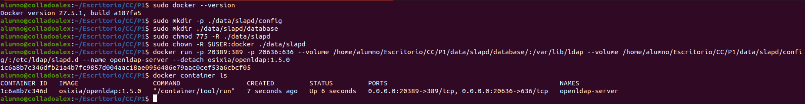

Se verifica el estado del directorio LDAP usando:

```bash
ldapsearch -x -H ldap://localhost:20389 -b dc=example,dc=org -D "cn=admin,dc=example,dc=org" -w admin
```

Y creo ahora dos usuarios a partir de archivos con extensión .ldif:

```bash
ldapadd -x -D "cn=admin,dc=example,dc=org" -w admin -c -f colladoalex.ldif -H ldap://localhost:20389
ldapadd -x -D "cn=admin,dc=example,dc=org" -w admin -c -f user2.ldif -H ldap://localhost:20389
```

En donde el formato de los archivos será:

```
dn: uid=colladoalex,dc=example,dc=org
cn: colladoalex
uid: colladoalex
sn: 3
objectClass: top
objectClass: posixAccount
objectClass: inetOrgPerson
uidNumber: 501
gidNumber: 20
homeDirectory: /home/alumno
loginShell: /bin/bash
gecos: colladoalex
userPassword: {crypt}x
```

```
dn: uid=user2,dc=example,dc=org
cn: user2
uid: user2
sn: 3
objectClass: top
objectClass: posixAccount
objectClass: inetOrgPerson
uidNumber: 501
gidNumber: 20
homeDirectory: /home/alumno2
loginShell: /bin/bash
gecos: user2
userPassword: {crypt}x
```

Y se puede comprobar que se han añadido correctamente se realiza la consulta:
```bash
ldapsearch -x -H ldap://localhost:20389 -b dc=example,dc=org -D "cn=admin,dc=example,dc=org" -w admin
```

Y como se puede ver en la salida, están ambos usuarios creados colladoalex y user2:

``` 
alumno@colladoalex:~/Escritorio/CC/P1$ ldapsearch -x -H ldap://localhost:20389 -b dc=example,dc=org -D "cn=admin,dc=example,dc=org" -w admin
# extended LDIF
#
# LDAPv3
# base <dc=example,dc=org> with scope subtree
# filter: (objectclass=*)
# requesting: ALL
#

# example.org
dn: dc=example,dc=org
objectClass: top
objectClass: dcObject
objectClass: organization
o: Example Inc.
dc: example

# colladoalex, example.org
dn: uid=colladoalex,dc=example,dc=org
cn: colladoalex
uid: colladoalex
sn: 3
objectClass: top
objectClass: posixAccount
objectClass: inetOrgPerson
uidNumber: 501
gidNumber: 20
homeDirectory: /home/alumno
loginShell: /bin/bash
gecos: colladoalex
userPassword:: e2NyeXB0fXg=

# user2, example.org
dn: uid=user2,dc=example,dc=org
cn: user2
uid: user2
sn: 3
objectClass: top
objectClass: posixAccount
objectClass: inetOrgPerson
uidNumber: 501
gidNumber: 20
homeDirectory: /home/alumno2
loginShell: /bin/bash
gecos: user2
userPassword:: e2NyeXB0fXg=

# search result
search: 2
result: 0 Success

# numResponses: 4
# numEntries: 3
```

Ahora para comprobar la persistencia del servicio OpenLDAP bajo el contenedor utilizando el ID de mi contenedor que se puede obtener listando los contenedores:
``` bash
docker container ls
docker rm -f 1c6a8b7c346d
```

Y vuelvo a lanzar el servicio con:
``` bash
docker run -p 20389:389 -p 20636:636 --volume /home/alumno/Escritorio/CC/P1/data/slapd/database:/var/lib/ldap --volume /home/alumno/Escritorio/CC/P1/data/slapd/config:/etc/ldap/slapd.d --name openldap-server  --detach osixia/openldap:1.5.0 
```

Y compruebo nuevamente con:
``` bash
ldapsearch -x -H ldap://localhost:20389 -b dc=example,dc=org -D "cn=admin,dc=example,dc=org" -w admin
```

Como se observa en la siguiente imagen, los datos de los usuarios siguen aún habiendo detenido y vuelto a iniciar el servidor:

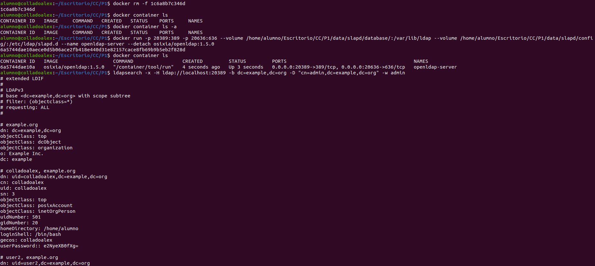
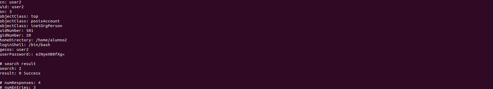

## Desplegar MariaDB

Para asegurar la persistencia de los datos en la base de datos usando MariaDB habrá que crear un directorio en:

``` bash
mkdir /home/alumno/Escritorio/CC/P1/MariaDB_data
```

Y luego correr el contenedor con la imagen de MariaDB con el comando:

``` bash
$ docker run --detach --name mariadb -v /home/alumno/Escritorio/CC/P1/MariaDB_data:/var/lib/mysql --env MARIADB_DATABASE=Practica1 --env MARIADB_USER=colladoalex --env MARIADB_PASSWORD=colladoalex --env MARIADB_ROOT_PASSWORD=colladoalex-root  mariadb:latest
```

## Desplegar OwnCloud

Primero que todo, habrá que descargarse la imagen del contenedor OwnCloud y luego lanzarla

``` bash
docker pull owncloud
docker run -d -p 20080:80 owncloud:latest
```

## Desplegar Flask y Redis

Para el despliegue de los contenedores con el aplicación flask y el servicio de redis se necesitará crear el archivo app.py, el archivo Dockerfile, docker-compose y el requirements.txt para las dependencias necesarias

El archivo app.py quedaría tal que:


``` python
from flask import Flask
import redis
import os
import socket
import time

app = Flask(__name__)
cache = redis.Redis(host="redis", port=6379)

def get_hit_count():
    retries = 5
    while True:
        try:
            return cache.incr('hits')
        except redis.exceptions.ConnectionError as exc:
            if retries == 0:
                raise exc
            retries -= 1
            time.sleep(0.5)

@app.route("/")
def hello():
    count = get_hit_count()
    return 'Hello World! I have been seen {} time.\n'.format(count)

if __name__ == "__main__":
    app.run(host="0.0.0.0", port=5000)

```

El archivo de requirements.txt:
```
flask
redis
```

El archivo Dockerfile:
``` Dockerfile
FROM python:3.8.10

WORKDIR /app

COPY requirements.txt ./
RUN pip install --no-cache-dir -r requirements.txt

COPY . .

EXPOSE 5000

CMD ["python", "app.py"]
```

Y por último el docker-compose.yml:
``` yaml
version: '3'
services:
  redis:
    image: "redis:alpine"
    container_name: redis
    ports:
      - "6379:6379"

  web:
    build: .
    container_name: flask_app
    ports:
      - "5000:5000"
    depends_on:
      - redis
```

Con estos archivos, solo quedaría iniciar los contenedores usando el comando:
``` bash
docker-compose up --build
```

## Despliegue usando docker-compose

Llegados a este punto y luego de tener que detener y levantar los contenedores uno a uno he decidido realizar un único docker-compose.yml que me levante todos los contenedores a la vez. El archivo docker-compose.yml es el siguiente:

``` yaml
version: '3.8'

services:
  mariadb:
    image: mariadb:latest
    container_name: mariadb
    restart: always
    volumes:
      - /home/alumno/Escritorio/CC/P1/MariaDB_data:/var/lib/mysql
    environment:
      MARIADB_DATABASE: Practica1
      MARIADB_USER: colladoalex
      MARIADB_PASSWORD: colladoalex
      MARIADB_ROOT_PASSWORD: colladoalex-root

  owncloud:
    image: owncloud:latest
    container_name: owncloud
    restart: always
    depends_on:
      - mariadb
      - flask_app
      - redis
      - openldap-server
    ports:
      - "20080:80"
    environment:
      OWNCLOUD_DB_TYPE: mysql
      OWNCLOUD_DB_HOST: mariadb
      OWNCLOUD_DB_NAME: Practica1
      OWNCLOUD_DB_USERNAME: colladoalex
      OWNCLOUD_DB_PASSWORD: colladoalex

  openldap:
    image: osixia/openldap:1.5.0
    container_name: openldap-server
    restart: always
    ports:
      - "20389:389"
      - "20636:636"
    volumes:
      - /home/alumno/Escritorio/CC/P1/data/slapd/database:/var/lib/ldap
      - /home/alumno/Escritorio/CC/P1/data/slapd/config:/etc/ldap/slapd.d

  redis:
    image: redis:alpine
    container_name: redis
    restart: always
    ports:
      - "6379:6379"

  flask_app:
    build: .
    container_name: flask_app
    restart: always
    depends_on:
      - redis
    ports:
      - "5000:5000"
```

Al tener el archivo docker-compose.yml solo haría falta ejecutar el comando:
``` yaml
docker-compose up --build -d
```
## Configuración de Owncloud

### Configuración inicial

Una vez lanzado todos los contenedores:

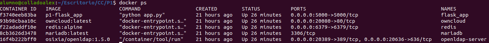

Habrá que configurar correctamente Owncloud, para ello habrá que ir a http://localhost:20080 y configurar el username y password. En este caso ambos son admin.

Además habrá que configurar la base de datos con la del contenedor con MariaDB que tengo. Para ello:

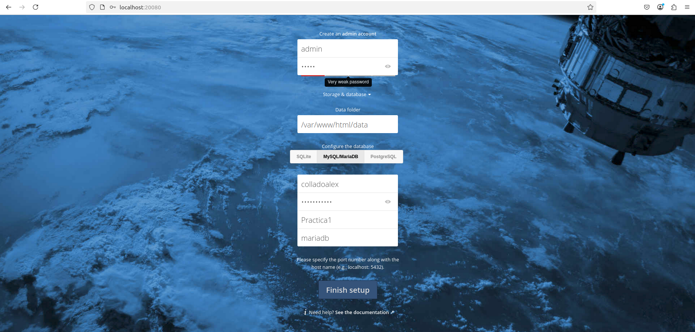

(En vez de localhost hay que colocar el nombre del contenedor en el cual se está ejecutando la imagen de mariadb, en mi caso, se llama mariadb)

### Configuracion LDAP en Owncloud

Para una correcta configuración de LDAP primero habrá que instalarme la extensión necesaria en la ventana de Market:

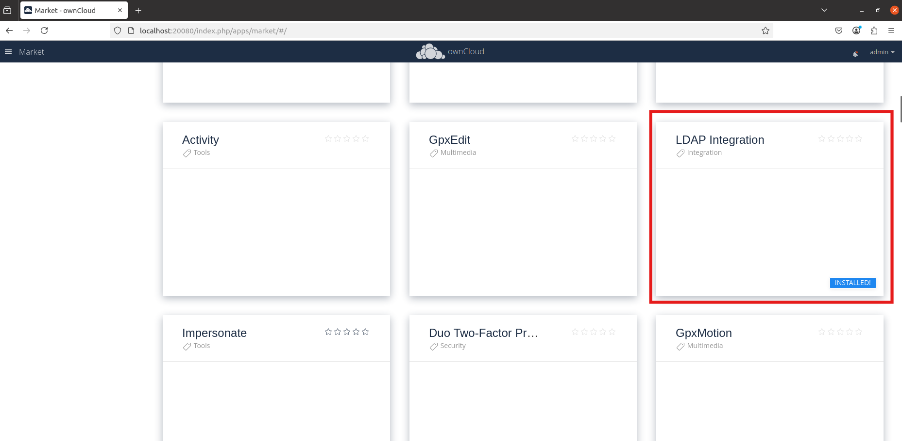

Luego habrá que configurar correctamente en la ventana de User Authentication en Settings:

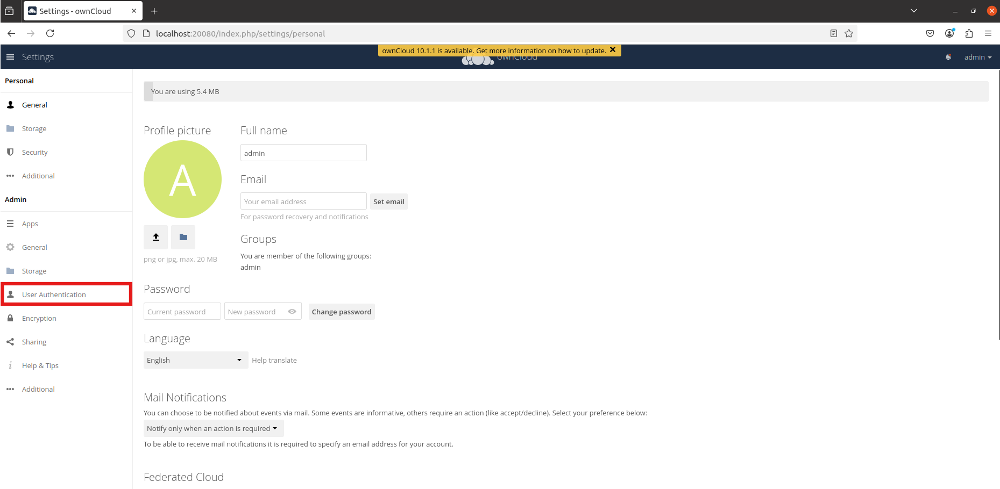

En la pestaña Server, configuramos los detalles de conexión con el servidor OpenLDA con los siguientes parámetros:

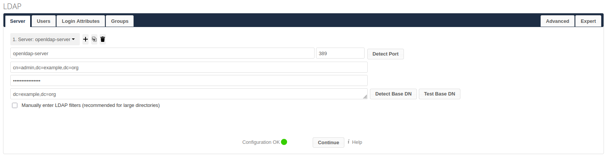

En la pestaña Users, definimos qué objetos dentro del directorio LDAP serán considerados usuarios de ownCloud:

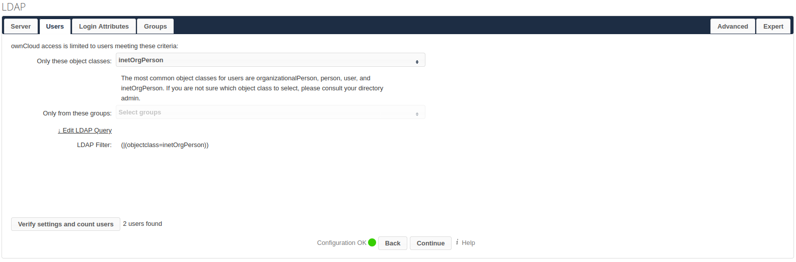

En la pestaña Login Attributes, configuramos cómo ownCloud identifica a los usuarios LDAP al iniciar sesión:

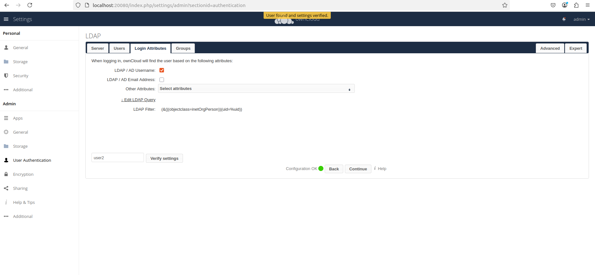

En la pestaña LDAP Configuration Advance, se definen los parámetros esenciales para la integración con OpenLDAP, asegurando que ownCloud pueda autenticar y gestionar usuarios del directorio LDAP:

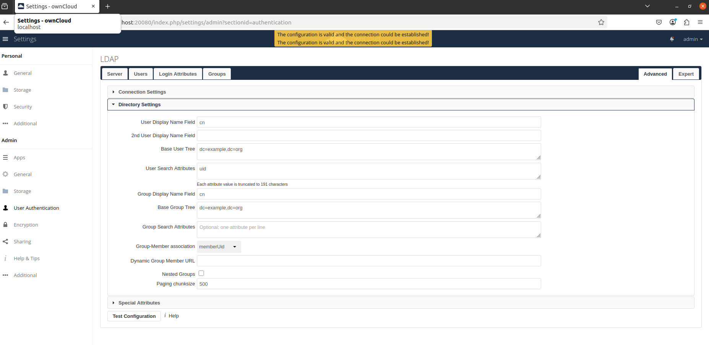