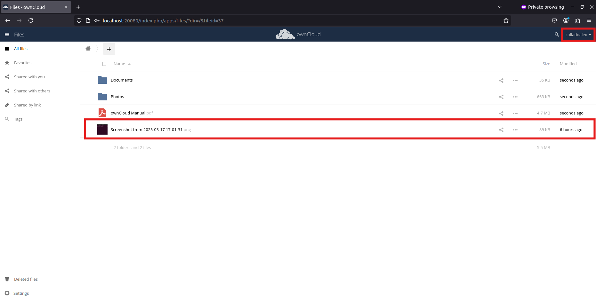

<h1>Práctica 1 - Alexander Collado Rojas</h1>

Se puede encontrar este README.md en: [README](https://github.com/AlexColladodev/CC-2425/tree/main/P1)

# Especificaciones del sistema

Arquitectura: x86_64

Modo de operación: 32-bit, 64-bit

Orden de bytes: Little Endian

Direcciones: 39 bits físicas, 48 bits virtuales

CPU:
- Modelo: 11th Gen Intel(R) Core(TM) i5-11400H @ 2.70GHz
- Núcleos: 2
- Hilos por núcleo: 1
- Velocidad: 2687.996 MHz
- Virtualización: KVM (Kernel-based Virtual Machine)

Caché:
- L1d: 96 KiB
- L1i: 64 KiB
- L2: 2.5 MiB
- L3: 24 MiB

Memoria RAM: 4 GiB

Disco: 128 GiB (VirtualBox)

- Particiones:

  - /boot: 487 MiB

  - SWAP: 1.9 GiB

  - /: 125.6 GiB

Sistema Operativo: Ubuntu con kernel 5.4.0-208-generic

Interfaz de red: Ethernet VirtualBox, 1Gbit/s

Virtualización: Entorno virtualizado en VirtualBox

# Escenario 1

## Error en galeon.ugr.es

Inicialmente, se intentó realizar la práctica en el servidor de la universidad. Pero, al configurar el contenedor LDAP con persistencia utilizando el comando que se indica en el guión de las prácticas:

``` bash
docker run -p 20560:389 -p 20561:636 --volume /home/colladoalex/data/slapd/database:/var/lib/ldap --volume /home/colladoalex/data/slapd/config:/etc/ldap/slapd.d --name openldap-server  --detach osixia/openldap:1.5.0 
```

Se presentó un error relacionado con operaciones no permitidas, lo que provocaba que el contenedor fallara y terminara. Aunque se hayan aplicado los cambios de permisos indicados en el guion:

``` bash
sudo usermod -aG docker $USER # Permiso denegado
newgrp docker
sudo chmod 775 -R /home/colladoalex/data/slapd
sudo chown -R $USER:docker /home/colladoalex/data/slapd
```

Al usar docker logs openldap-server sale lo siguiente:


Debido a esto, se optó por llevar a cabo la práctica en una máquina virtual con Linux, utilizando VirtualBox.

## Configuración del entorno

Como se mencionó anteriormente, se utilizará una máquina virtual con Linux para la práctica. Dicha máquina no contaba con Docker, Snap ni los paquetes necesarios para llevar a cabo el trabajo, por lo que el primer paso será la instalación.

Actualizar los paquetes existentes:

```bash
sudo apt-get update
sudo apt-get upgrade
```


Instalar snap en el sistema para la gestión de paquetes:
```bash
sudo apt-get install snap
```


Instalar docker con snap:
```bash
sudo snap install docker
```

Crear un grupo con el nombre docker y añadir al usuario actual al grupo. Luego reiniciar la sesión para aplicar cambios:
```bash
sudo groupadd docker
sudo usermod -aG docker $USER
newgrp docker
```


Modificar el grupo docker para que se pueda usar los comandos docker sin necesidad de utilizar la instrucción sudo cada vez.
```bash
sudo chown root:docker /var/run/docker.sock
```

Para el uso de comandos tipo "ldapsearch" hay que instalar la dependencia requerida:
```bash
sudo apt install ldap-utils
```

## Desplegar OpenLDAP

Luego de haber hecho la prueba de desplegar el servicio OpenLDAP sin persistencia utilizando el comando:

```bash
docker run -d -p 20389:389 --name openldap-server -t osixia/openldap:1.5.0 
```

Se procederá a eliminar este contenedor para desplegar el servicio con persistencia en los datos. Esto significa que, si el contenedor se detiene y se vuelve a iniciar, los datos de autenticación almacenados permanecerán.

Se deben montar volúmenes de datos permanentes para el directorio LDAP, de forma que cualquier cambio en los datos sea visible y persistente fuera del contenedor, incluso si el servicio se cayera o se interrumpiera.

Para ello, creamos dos carpetas para almacenar datos de LDAP:

```bash
sudo mkdir -p ./data/slapd/config
sudo mkdir ./data/slapd/database
```

Y se conceden los permisos adecuados sobre estas carpetas:

```bash
sudo chmod 775 -R ./data/slapd
sudo chown -R $USER:docker ./data/slapd
```

Ahora, montamos estas carpetas como volúmenes de datos permanentes al lanzar el contenedor:

```bash
docker run -p 20389:389 -p 20636:636 --volume /home/alumno/Escritorio/CC/P1/data/slapd/database:/var/lib/ldap --volume /home/alumno/Escritorio/CC/P1/data/slapd/config:/etc/ldap/slapd.d --name openldap-server  --detach osixia/openldap:1.5.0 
```

Y se puede observar que el contenedor está creado y levantado usando:

```bash
docker container ls
```

Se puede ver en la siguiente imagen que todo va correcto:


Se verifica el estado del directorio LDAP usando:

```bash
ldapsearch -x -H ldap://localhost:20389 -b dc=example,dc=org -D "cn=admin,dc=example,dc=org" -w admin
```

Y creo ahora dos usuarios a partir de archivos con extensión .ldif:

```bash
ldapadd -x -D "cn=admin,dc=example,dc=org" -w admin -c -f colladoalex.ldif -H ldap://localhost:20389
ldapadd -x -D "cn=admin,dc=example,dc=org" -w admin -c -f user2.ldif -H ldap://localhost:20389
```

En donde el formato de los archivos será:

```
dn: uid=colladoalex,dc=example,dc=org
cn: colladoalex
uid: colladoalex
sn: 3
objectClass: top
objectClass: posixAccount
objectClass: inetOrgPerson
uidNumber: 501
gidNumber: 20
homeDirectory: /home/alumno
loginShell: /bin/bash
gecos: colladoalex
userPassword: {crypt}x
```

```
dn: uid=user2,dc=example,dc=org
cn: user2
uid: user2
sn: 3
objectClass: top
objectClass: posixAccount
objectClass: inetOrgPerson
uidNumber: 501
gidNumber: 20
homeDirectory: /home/alumno2
loginShell: /bin/bash
gecos: user2
userPassword: {crypt}x
```

Y se puede comprobar que se han añadido correctamente se realiza la consulta:
```bash
ldapsearch -x -H ldap://localhost:20389 -b dc=example,dc=org -D "cn=admin,dc=example,dc=org" -w admin
```

Y como se puede ver en la salida, están ambos usuarios creados colladoalex y user2:

``` 
alumno@colladoalex:~/Escritorio/CC/P1$ ldapsearch -x -H ldap://localhost:20389 -b dc=example,dc=org -D "cn=admin,dc=example,dc=org" -w admin
# extended LDIF
#
# LDAPv3
# base <dc=example,dc=org> with scope subtree
# filter: (objectclass=*)
# requesting: ALL
#

# example.org
dn: dc=example,dc=org
objectClass: top
objectClass: dcObject
objectClass: organization
o: Example Inc.
dc: example

# colladoalex, example.org
dn: uid=colladoalex,dc=example,dc=org
cn: colladoalex
uid: colladoalex
sn: 3
objectClass: top
objectClass: posixAccount
objectClass: inetOrgPerson
uidNumber: 501
gidNumber: 20
homeDirectory: /home/alumno
loginShell: /bin/bash
gecos: colladoalex
userPassword:: e2NyeXB0fXg=

# user2, example.org
dn: uid=user2,dc=example,dc=org
cn: user2
uid: user2
sn: 3
objectClass: top
objectClass: posixAccount
objectClass: inetOrgPerson
uidNumber: 501
gidNumber: 20
homeDirectory: /home/alumno2
loginShell: /bin/bash
gecos: user2
userPassword:: e2NyeXB0fXg=

# search result
search: 2
result: 0 Success

# numResponses: 4
# numEntries: 3
```

Ahora para comprobar la persistencia del servicio OpenLDAP bajo el contenedor utilizando el ID de mi contenedor que se puede obtener listando los contenedores:
``` bash
docker container ls
docker rm -f 1c6a8b7c346d
```

Y vuelvo a lanzar el servicio con:
``` bash
docker run -p 20389:389 -p 20636:636 --volume /home/alumno/Escritorio/CC/P1/data/slapd/database:/var/lib/ldap --volume /home/alumno/Escritorio/CC/P1/data/slapd/config:/etc/ldap/slapd.d --name openldap-server  --detach osixia/openldap:1.5.0 
```

Y compruebo nuevamente con:
``` bash
ldapsearch -x -H ldap://localhost:20389 -b dc=example,dc=org -D "cn=admin,dc=example,dc=org" -w admin
```

Como se observa en la siguiente imagen, los datos de los usuarios siguen aún habiendo detenido y vuelto a iniciar el servidor:


## Desplegar MariaDB

Para asegurar la persistencia de los datos en la base de datos usando MariaDB habrá que crear un directorio en:

``` bash
mkdir /home/alumno/Escritorio/CC/P1/MariaDB_data
```

Y luego correr el contenedor con la imagen de MariaDB con el comando:

``` bash
$ docker run --detach --name mariadb -v /home/alumno/Escritorio/CC/P1/MariaDB_data:/var/lib/mysql --env MARIADB_DATABASE=Practica1 --env MARIADB_USER=colladoalex --env MARIADB_PASSWORD=colladoalex --env MARIADB_ROOT_PASSWORD=colladoalex-root  mariadb:latest
```

## Desplegar OwnCloud

Primero que todo, habrá que descargarse la imagen del contenedor OwnCloud y luego lanzarla

``` bash
docker pull owncloud
docker run -d -p 20080:80 owncloud:latest
```

Para que exista la persistencia de los datos aunque se elimine el contenedor habrá que crear un directorio y usar un volumen de persistencia que guarde las configuraciones localmente:

``` bash
mkdir -p /home/alumno/Escritorio/CC/P1/owncloud_data
docker run -d --name owncloud -p 20080:80  -v /home/alumno/Escritorio/CC/P1/owncloud_data:/var/www/html owncloud:latest
```

## Desplegar Redis

Usando docker-compose.yml
``` yaml
version: '3'
services:
  redis:
    image: "redis:alpine"
    container_name: redis
    ports:
      - "6379:6379"
```

Con estos archivos, solo quedaría iniciar los contenedores usando el comando:
``` bash
docker-compose up --build
```

## Despliegue usando docker-compose

Llegados a este punto y luego de tener que detener y levantar los contenedores uno a uno he decidido realizar un único docker-compose.yml que me levante todos los contenedores a la vez. El archivo docker-compose.yml es el siguiente:

``` yaml
version: '3.8'

services:
  mariadb:
    image: mariadb:latest
    container_name: mariadb
    restart: always
    volumes:
      - /home/alumno/Escritorio/CC/P1/MariaDB_data:/var/lib/mysql
    environment:
      MARIADB_DATABASE: Practica1
      MARIADB_USER: colladoalex
      MARIADB_PASSWORD: colladoalex
      MARIADB_ROOT_PASSWORD: colladoalex-root

  openldap:
    image: osixia/openldap:1.5.0
    container_name: openldap-server
    restart: always
    ports:
      - "20389:389"
      - "20636:636"
    volumes:
      - /home/alumno/Escritorio/CC/P1/data/slapd/database:/var/lib/ldap
      - /home/alumno/Escritorio/CC/P1/data/slapd/config:/etc/ldap/slapd.d

  redis:
    image: redis:alpine
    container_name: redis
    restart: always
    ports:
      - "6379:6379"

  flask_app:
    build: .
    container_name: flask_app
    restart: always
    depends_on:
      - redis
    ports:
      - "5000:5000"

  owncloud:
    image: owncloud:latest
    container_name: owncloud
    restart: always
    depends_on:
      - mariadb
      - flask_app
      - redis
      - openldap
    ports:
      - "20080:80"
    environment:
      OWNCLOUD_DB_TYPE: mysql
      OWNCLOUD_DB_HOST: mariadb
      OWNCLOUD_DB_NAME: Practica1
      OWNCLOUD_DB_USERNAME: colladoalex
      OWNCLOUD_DB_PASSWORD: colladoalex
    volumes:
      - /home/alumno/Escritorio/CC/P1/owncloud_data:/var/www/html

volumes:
  owncloud_data:
    driver: local
```

Al tener el archivo docker-compose.yml solo haría falta ejecutar el comando:
``` bash
docker-compose up --build -d
```
## Configuración de Owncloud

### Configuración inicial

Una vez lanzado todos los contenedores:


Habrá que configurar correctamente Owncloud, para ello habrá que ir a http://localhost:20080 y configurar el username y password. En este caso ambos son admin.

Además habrá que configurar la base de datos con la del contenedor con MariaDB que tengo. Para ello:


(En vez de localhost hay que colocar el nombre del contenedor en el cual se está ejecutando la imagen de mariadb, en mi caso, se llama mariadb)

### Configuracion LDAP en Owncloud

Para una correcta configuración de LDAP primero habrá que instalarme la extensión necesaria en la ventana de Market:


Luego habrá que configurar correctamente en la ventana de User Authentication en Settings:


En la pestaña Server, configuramos los detalles de conexión con el servidor OpenLDA con los siguientes parámetros:


En la pestaña Users, definimos qué objetos dentro del directorio LDAP serán considerados usuarios de ownCloud:


En la pestaña Login Attributes, configuramos cómo ownCloud identifica a los usuarios LDAP al iniciar sesión:


En la pestaña LDAP Configuration Advance, se definen los parámetros esenciales para la integración con OpenLDAP, asegurando que ownCloud pueda autenticar y gestionar usuarios del directorio LDAP:


Se pueden observar los usuarios que se han autenticado si vamos a la ventana de users:


Y por último, se inicia sesión con uno de los usuarios y subimos un archivo comprobando que todo funciona perfectamente:

Antes de eso hay que cambiar la contraseña del usuario manualmente utilizando:

``` bash
ldappasswd -x -D "cn=admin,dc=example,dc=org" -w admin -H ldap://localhost:20389 -s <contraseña> "uid=<usuario>,dc=example,dc=org"
```

Y ahora se inicia usando el usuario y contraseña:



# Escenario 2

## Despliegue de contenedores con docker-compose

En este escenario, se utilizará docker-compose para desplegar todos los servicios necesarios de manera coordinada:

``` yml
version: '3.8'

services:
  haproxy:
    image: haproxy:latest
    container_name: haproxy
    restart: always
    ports:
      - "8080:80"
    networks:
      - owncloud_network
    volumes:
      - ./haproxy.cfg:/usr/local/etc/haproxy/haproxy.cfg
    depends_on:
      - owncloud1
      - owncloud2

  mariadb_principal:
    image: mariadb:latest
    container_name: mariadb_principal
    restart: always
    ports:
      - "3307:3306"
    networks:
      - owncloud_network
    volumes:
      - /home/alumno/Escritorio/CC/P1_2/MariaDB_data:/var/lib/mysql
    environment:
      MARIADB_REPLICATION_MODE: master
      MARIADB_ROOT_PASSWORD: colladoalex-root
      MARIADB_DATABASE: Practica1_2
      MARIADB_USER: colladoalex
      MARIADB_PASSWORD: colladoalex

  mariadb_replica:
    image: mariadb:latest
    container_name: mariadb_replica
    restart: always
    ports:
      - "3308:3306"
    networks:
      - owncloud_network
    environment:
      MARIADB_REPLICATION_MODE: slave
      MARIADB_ROOT_PASSWORD: colladoalex-root
      MARIADB_MASTER_HOST: mariadb_principal
      MARIADB_MASTER_USER: colladoalex
      MARIADB_MASTER_PASSWORD: colladoalex
      MARIADB_REPLICATION_USER: colladoalex
      MARIADB_REPLICATION_PASSWORD: colladoalex

  openldap:
    image: osixia/openldap:1.5.0
    container_name: openldap-server
    restart: always
    ports:
      - "20390:389"
      - "20637:636"
    networks:
      - owncloud_network
    volumes:
      - /home/alumno/Escritorio/CC/P1_2/data/slapd/database:/var/lib/ldap
      - /home/alumno/Escritorio/CC/P1_2/data/slapd/config:/etc/ldap/slapd.d

  redis:
    image: redis:alpine
    container_name: redis
    restart: always
    networks:
      - owncloud_network
    ports:
      - "6380:6379"

  owncloud1:
    image: owncloud:latest
    container_name: owncloud1
    restart: always
    networks:
      - owncloud_network
    depends_on:
      - mariadb_principal
      - redis
      - openldap
    ports:
      - "21080:80"
    environment:
      OWNCLOUD_DB_TYPE: mysql
      OWNCLOUD_DB_HOST: mariadb_principal
      OWNCLOUD_DB_NAME: Practica1_2
      OWNCLOUD_DB_USERNAME: colladoalex
      OWNCLOUD_DB_PASSWORD: colladoalex
    volumes:
      - /home/alumno/Escritorio/CC/P1_2/owncloud_files:/var/www/html/data
      - /home/alumno/Escritorio/CC/P1_2/owncloud_config:/var/www/html/config
      - /home/alumno/Escritorio/CC/P1_2/owncloud_apps:/var/www/html/apps

  owncloud2:
    image: owncloud:latest
    container_name: owncloud2
    restart: always
    networks:
      - owncloud_network
    depends_on:
      - mariadb_principal
      - redis
      - openldap
    ports:
      - "21081:80"
    environment:
      OWNCLOUD_DB_TYPE: mysql
      OWNCLOUD_DB_HOST: mariadb_principal
      OWNCLOUD_DB_NAME: Practica1_2
      OWNCLOUD_DB_USERNAME: colladoalex
      OWNCLOUD_DB_PASSWORD: colladoalex
    volumes:
      - /home/alumno/Escritorio/CC/P1_2/owncloud_files:/var/www/html/data
      - /home/alumno/Escritorio/CC/P1_2/owncloud_config:/var/www/html/config
      - /home/alumno/Escritorio/CC/P1_2/owncloud_apps:/var/www/html/apps

networks:
  owncloud_network:
    driver: bridge
```

Para ello, se configurará un contenedor con HAProxy, que se encargará del balanceo de carga. Este servicio mapeará el puerto 8080 en el host al puerto 80 dentro del contenedor y estará conectado a la red de contenedores owncloud_network con todos los demás contenedores.

Se desplegará un contenedor con la base de datos principal, idéntico al del Escenario 1, pero con un mapeo de puertos distinto. Esto asegurará que, en caso de que ambos escenarios estén activos al mismo tiempo, no haya conflictos de conexión.

Además, se añadirá un contenedor con la réplica de la base de datos, el cual actuará en modo secundario. Para su configuración, se definirán las siguientes variables de entorno:
- MARIADB_MASTER_HOST para especificar la dirección del host maestro de la base de datos.
- MARIADB_REPLICATION_MODE para establecer el modo de replicación.
- MARIADB_REPLICATION_USER y MARIADB_REPLICATION_PASSWORD para gestionar la autenticación de la replicación.

Para la autenticación de usuarios, se incluirá un contenedor con OpenLDAP, configurado de manera similar al Escenario 1, pero con un mapeo de puertos diferente para evitar conflictos.

También se lanzará un contenedor con Redis, utilizado para la gestión de caché. Como en los otros servicios, el mapeo de puertos será ajustado para evitar interferencias con el primer escenario.

Finalmente, se desplegarán dos instancias de OwnCloud, que actuarán como servicios web. Ambos contenedores compartirán la misma información. Para ello hay que indicarle en los volúmenes de persistencia que apunten al mismo archivo de configuración. De tal forma que al configurar uno se configura el otro automáticamente. Esto pasa igual con los archivos de apps (para LDAP Integration)

Para este escenario, se han creado nuevos directorios destinados a los volúmenes de persistencia de los contenedores, asegurando la conservación de los datos incluso en caso de reinicio o detención de los servicios.

``` bash
mkdir owncloud_files
mkdir owncloud_config
mkdir owncloud_apps
```

Se ha definido una red interna llamada owncloud_network utilizando el controlador de red bridge. Esta red permite que los contenedores se comuniquen entre sí sin exponerlos directamente a la red externa.


## Creación usuarios OpenLDAP

Tal como en el Escenario 1, se crearán dos usuarios mediante archivos `.ldif`, manteniendo la misma estructura utilizada anteriormente. La única diferencia será en la nomenclatura de los usuarios, que tendrán nombres distintos para diferenciarlos entre escenarios.  

En este caso, se han creado los usuarios `user2s2` y `colladoalexs2`.  

``` bash
#Comprobar el puerto. Para el escenario 2 se cambió a 20390 en vez de 20389 del escenario 1
ldapadd -x -D "cn=admin,dc=example,dc=org" -w admin -c -f colladoalexs2.ldif -H ldap://localhost:20390
ldapadd -x -D "cn=admin,dc=example,dc=org" -w admin -c -f user2s2.ldif -H ldap://localhost:20390
```

## Configuración HAProxy

HAProxy distribuye las conexiones entre dos servidores OwnCloud (owncloud1 y owncloud2) usando balanceo de carga round-robin. Si un servidor falla, redirige las peticiones al otro automáticamente

``` cfg
global
    log stdout format raw local0
    maxconn 4096      

defaults
    log global
    mode http
    option httplog
    timeout connect 10000ms
    timeout client 60000ms
    timeout server 60000ms

frontend http_front
    bind *:80
    default_backend owncloud_servers
    option forwardfor except 127.0.0.1
    http-request set-header X-Forwarded-Proto https


backend owncloud_servers
    balance roundrobin
    cookie SERVERID insert indirect nocache
    server owncloud1 owncloud1:80 check cookie oc1
    server owncloud2 owncloud2:80 check cookie oc2

backend ldap_backend
    balance roundrobin
    server ldap1 openldap-server:389 check
```

Balanceo de carga: Distribuye las peticiones entre owncloud1 y owncloud2 de manera equitativa.

Persistencia de sesión: Se usa una cookie (SERVERID) para mantener la sesión del usuario en el mismo servidor.

Encabezados HTTP: Se configura X-Forwarded-Proto para manejar conexiones HTTPS correctamente.

## Configuración Owncloud

Como en el escenario 1 se configura nuevamente owncloud:


Nuevamente se descarga LDAP Integration en la sección de Market de Owncloud y se configura idéntico al escenario 1. Como tenemos el volumen de aplicaciones solo hará falta configurarlo en localhost:21080 o en localhost:21081

Para que OwnCloud funcione correctamente detrás de HAProxy, es necesario modificar el archivo config.php dentro del contenedor de OwnCloud.

Copio el archivo config.php que se genera luego de realizar la configuración por primera vez:

``` bash
docker cp owncloud1:/var/www/html/config/config.php .
```

Edito el archivo añadiéndole las siguientes líneas:

``` bash
'trusted_proxies' => ['haproxy'],
'overwritehost' => 'localhost:8080',
'overwriteprotocol' => 'http',
```

Copio el archivo modificado local en el contenedor:

``` bash
docker cp config.php owncloud1:/var/www/html/config/config.php
```

Cambio los permisos del archivo dentro del contenedor porque puede que al copiarlo fuera se hayan modificado:

``` bash
chown -R www-data:www-data /var/www/html/config
chmod -R 755 /var/www/html/config

```
Reinicio los contenedores y listo:

``` bash
docker restart owncloud1 owncloud2
```

## Funcionamiento

Y como se puede observar, se accede mediante haproxy usando la dirección localhost:8080:

