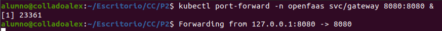

# Práctica 2

## Instalación de Minikube

Para llevar a cabo la instalación de MiniKube, se seguirá el procedimiento descrito en el guión de la sesión 4. Como se indica en el guión, es necesario tener instalado previamente con Docker, kubectl y minikube instalados en el sistema.

Ya que Docker ya fue instalado correctamente durante la realización de la práctica 1, el siguiente paso será instalar minikube y kubectl.

Para ello descargaremos minikube utilizando:

``` bash
curl -LO https://github.com/kubernetes/minikube/releases/latest/download/minikube-linux-amd64
sudo install minikube-linux-amd64 /usr/local/bin/minikube && rm minikube-linux-amd64
```

Además, se descargará e instalará kubectl con:
``` bash
curl -LO "https://dl.k8s.io/release/$(curl -L -s https://dl.k8s.io/release/stable.txt)/bin/linux/amd64/kubectl"

install kubectl ~/.local/bin/kubectl && rm kubectl
```

Y una vez realizada la descarga iniciaremos el cluster con la instrucción, si se inicia correctamente ya tendría minikube instalado:

``` bash
minikube start
```

Se puede ver el estado de Minikube para comprobar que todo ha ido correctamente usando:

``` bash
minikube status
```


## Instalación de OpenFaaS sobre Kubernetes

Para proceder con la instalación de OpenFaaS, es necesario haber iniciado previamente MiniKube, tal como se realizó en el apartado anterior.

En primer lugar, se descargará el instalador de aplicaciones para Kubernetes arkade y se verificará su correcto funcionamiento mediante los siguientes comandos:

``` bash
curl -sLS https://get.arkade.dev | sudo sh
arkade version
```

A continuación, se instalará el cliente oficial de OpenFaaS:

``` bash
curl -SLsf https://cli.openfaas.com | sudo sh
```

Finalmente, se instalará OpenFaaS utilizando arkade:

``` bash
arkade install openfaas
```

Si la instalación se ha realizado correctamente, se mostrarán comandos que permiten acceder y trabajar con OpenFaaS sobre Kubernetes.

A continuación, se procederá a instalar y verificar la instalación del cliente oficial de OpenFaaS mediante los siguientes comandos:

``` bash
curl -SLsf https://cli.openfaas.com | sudo sh
faas-cli version
```

Para desplegar el gateway y mapearlo al puerto 8080, se utilizan los siguientes comandos:

``` bash
kubectl rollout status -n openfaas deploy/gateway
kubectl port-forward -n openfaas svc/gateway 8080:8080 &
```



Para comprobar que el sistema funciona correctamente, se accede a la interfaz de OpenFaaS desde el navegador mediante la dirección http://localhost:8080.

Al ingresar, se solicitarán credenciales de acceso. Tal como se indica, el nombre de usuario por defecto es admin, y la contraseña se puede obtener ejecutando el siguiente comando:

``` bash
kubectl get secret -n openfaas basic-auth -o jsonpath="{.data.basic-auth-password}" | base64 --decode; echo
```

## Creación de funciones FaaS para reconocimiento facial

Antes de comenzar con el desarrollo de la funcionalidad, se descargará una plantilla específica para funciones en Python que permita realizar peticiones HTTP. Para ello, se utilizará la plantilla python3-http, recomendada en el catálogo.

Los comandos utilizados son los siguientes:

``` bash
faas-cli template store pull python3-http
faas-cli new face-detect --lang python3-http-debian
```

Con el segundo comando se crea una nueva función llamada face-detect, utilizando como base la plantilla previamente descargada.

Se puede observar que se crea la siguiente estructura de directorio:


Para garantizar el correcto funcionamiento de la función, es necesario modificar el archivo stack.yaml añadiendo la línea build_args con los paquetes adicionales requeridos. Sin esta configuración, se producirían errores al ejecutar la función debido a la falta de librerías necesarias para OpenCV, y además no se podrían realizar llamadas mediante curl desde el contenedor.

El contenido final del archivo stack.yaml será el siguiente:

``` yaml
version: 1.0
provider:
  name: openfaas
  gateway: http://127.0.0.1:8080
functions:
  face-detect:
    lang: python3-http-debian
    handler: ./face-detect
    image: alexcolladodev2/face-detect:latest
    build_args:
      ADDITIONAL_PACKAGE: "libgl1-mesa-glx libglib2.0-0 curl"
```

Por último, se construirá el archivo handle.py con el siguiente código:

``` python
import base64
import cv2
import numpy as np
import requests
import json

def handle(event, context):
    try:
        # Mostrar el cuerpo recibido
        print("Raw event body:")
        print(event.body)

        data = event.body
        if isinstance(data, bytes):
            data = data.decode('utf-8')

        parsed = json.loads(data)
        url = parsed.get("image_url", "")

        print(f"Parsed URL: {url}")

        if not url:
            return "Missing 'image_url' in request", 400

        try:
            response = requests.get(url, timeout=10)
            response.raise_for_status()
        except Exception as e:
            return f"Error downloading image: {str(e)}", 400

        img_array = np.frombuffer(response.content, np.uint8)
        img = cv2.imdecode(img_array, cv2.IMREAD_COLOR)

        if img is None:
            return "Image could not be decoded by OpenCV", 400

        face_cascade = cv2.CascadeClassifier(
            cv2.data.haarcascades + 'haarcascade_frontalface_default.xml'
        )

        gray = cv2.cvtColor(img, cv2.COLOR_BGR2GRAY)
        faces = face_cascade.detectMultiScale(gray, 1.1, 4)

        for (x, y, w, h) in faces:
            cv2.rectangle(img, (x, y), (x+w, y+h), (0, 255, 0), 2)

        _, buffer = cv2.imencode('.jpg', img)
        img_base64 = base64.b64encode(buffer).decode('utf-8')

        return img_base64

    except json.JSONDecodeError as e:
        return f"Invalid JSON: {str(e)}", 400
    except Exception as e:
        return f"Unhandled error: {str(e)}", 500
```

Y se definirá el archivo requirements.txt con las dependencias necesarias:

```
opencv-python
numpy
requests
```

Este código permite realizar reconocimiento facial a partir de una imagen obtenida por URL. En primer lugar, recibe una petición HTTP con un JSON que contiene el campo image_url. A continuación, descarga la imagen, la procesa utilizando OpenCV y un clasificador Haar para detectar rostros, y dibuja un rectángulo verde sobre cada uno de ellos. Finalmente, la imagen procesada se codifica en formato base64 y se devuelve como respuesta. En caso de error, se responde con un mensaje descriptivo y el código de error 500.

Una vez finalizada la implementación de la función y definidas sus dependencias, será necesario construir la imagen correspondiente mediante el siguiente comando:

``` bash
faas-cli build -f stack.yaml
```

Antes de proceder con el despliegue, es obligatorio disponer de una cuenta en Docker Hub, ya que OpenFaaS no permite desplegar imágenes que no sean públicas. Por tanto, será necesario crear una cuenta en dicha plataforma, iniciar sesión y hacer push de la imagen generada.

``` bash
docker tag local/face-detect alexcolladodev2/face-detect:latest
docker push alexcolladodev2/face-detect:latest
```

A continuación, se modificará el archivo stack.yaml para indicar la nueva ubicación de la imagen en Docker Hub, actualizando la línea correspondiente de la siguiente forma:

```
image: alexcolladodev2/face-detect:latest
```

Una vez hecho esto, se podrá desplegar la función con:

``` bash
faas-cli deploy -f stack.yaml
```

Para verificar que el despliegue se ha realizado correctamente, se puede utilizar el comando:

``` bash
faas-cli list
kubectl get pods -n openfaas-fn
```

Por último, para comprobar el correcto funcionamiento de la función desplegada, lo único que habría que hacer es realizar una petición HTTP POST utilizando curl, enviando un JSON con la URL de la imagen a procesar. La respuesta será una imagen codificada en base64 que, posteriormente, se decodificará para obtener el archivo final con los rostros detectados.

``` bash
curl -X POST http://localhost:8080/function/face-detect \
  -H "Content-Type: application/json" \
  -d '{"image_url": "https://raw.githubusercontent.com/opencv/opencv/master/samples/data/lena.jpg"}' \
  --output result.b64

base64 -d result.b64 > result.jpg
```